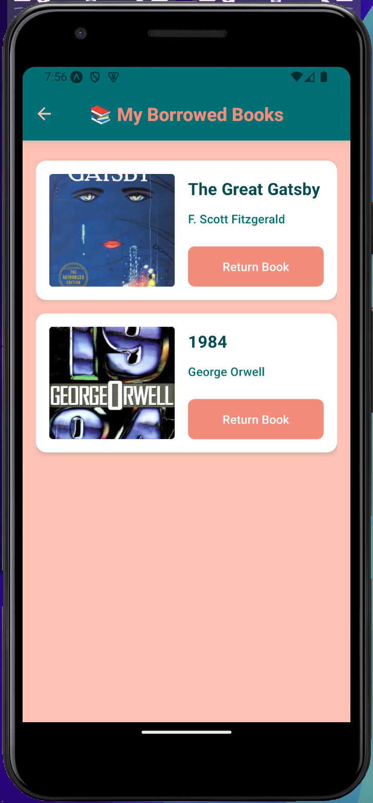
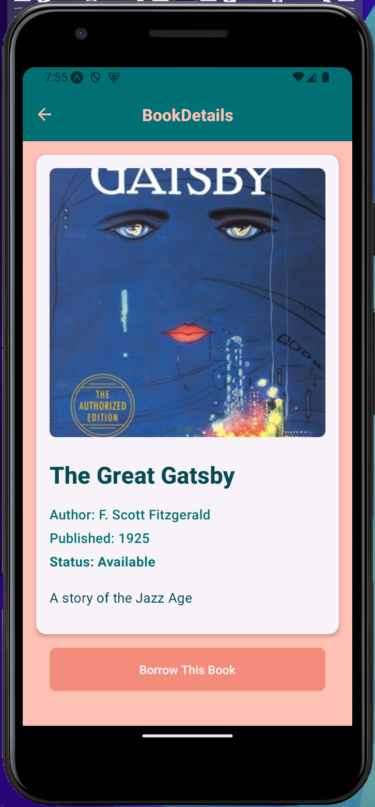
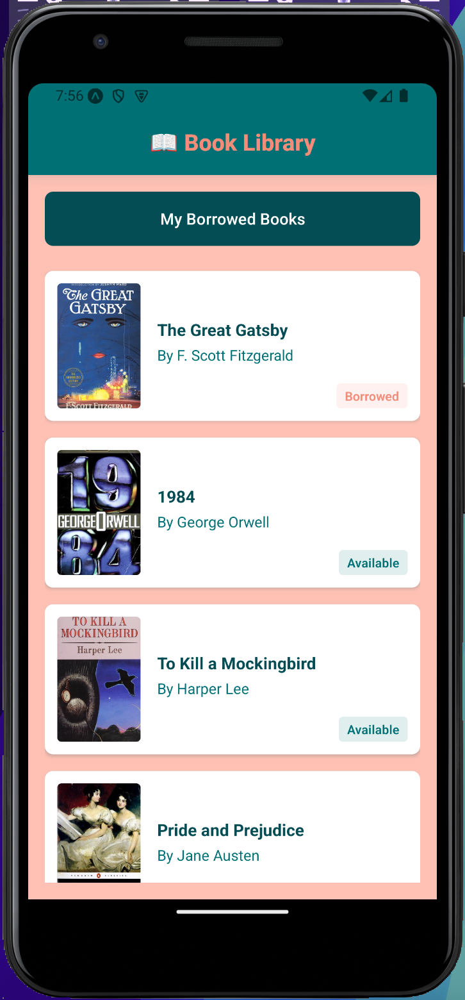

# Library-App

Library-App is a mobile application built with React Native that allows users to browse, borrow, and return books from a library.

## Features

- Browse a list of available books
- View detailed information about each book
- Borrow books (up to a maximum of 3 at a time)
- Return borrowed books
- View a list of borrowed books

## Screens

- Home - Book List Screen
- Book Detail Screen
- Borrowed Book Screen

## Screenshots

### App in Action


### Screens

| Borrowed Book Screen | Book Detail Screen |
| --- | --- |
|  |  |

| Home - Book List Screen | Home - Book List Screen |
| --- | --- |
|  |  |

## Installation

1. Clone the repository:

   ```sh
   git clone https://github.com/LalanaChami/Library-App.git
   cd Library-App
   ```

2. Install dependencies:

   ```sh
   npm install
   ```

3. Start the application:

   ```sh
   npm start
   ```

4. Run on Android:

   ```sh
   npm run android
   ```

5. Run on iOS:

   ```sh
   npm run ios
   ```

6. Run on Web:

   ```sh
   npm run web
   ```

## Technologies Used

- React Native
- Expo
- Firebase
- React Navigation
- React Native Paper

## License

This project is licensed under the 0BSD License.